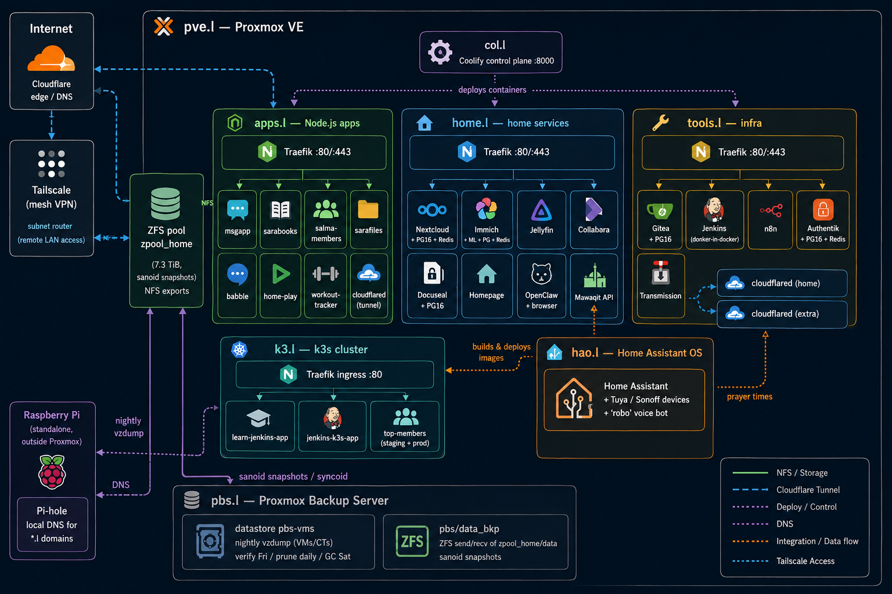

# Homelab

A self-hosted infrastructure I built and run end-to-end: Proxmox VE
virtualizing everything from CI/CD to home automation, backed by ZFS
snapshots replicated to a dedicated backup server, Docker workloads
deployed through Coolify, Traefik handling reverse proxying per host,
Cloudflare Tunnels keeping zero ports open to the internet, and a
separate k3s cluster for Kubernetes practice and pipeline experiments.

Every config here is sanitized and pulled straight from the running
system — nothing hand-written for show.

> All real hostnames are replaced with `*.example.home` / `*.example.com`,
> IPs with `10.0.x.x` placeholders, and every secret is a placeholder in a
> `.env.example`. Nothing here is usable verbatim against a live network —
> that's the point.

## Architecture


Full diagram + rationale: [`docs/architecture.md`](docs/architecture.md)

## Services

| Service | Host | Purpose | Stack |
|---------|------|---------|-------|
| msgapp | apps.l | Messaging | Node.js + Postgres |
| sarabooks | apps.l | Book catalog | Node.js + Postgres |
| salma-members | apps.l | Membership portal | Node.js + Postgres |
| sarafiles | apps.l | File upload/sharing | Node.js + Postgres + Cloudinary |
| babble | apps.l | Chat | Node.js |
| home-play | apps.l | Play dashboard | Static / Nginx |
| workout-tracker | apps.l | Fitness tracker | Node.js |
| Immich | home.l | Photos | Node.js + ML + Postgres + Redis |
| Nextcloud | home.l | File sync | Nextcloud + Postgres 16 + Redis |
| Jellyfin | home.l | Media | Jellyfin |
| Collabora | home.l | Online office | Collabora CODE |
| Docuseal | home.l | Document signing | Docuseal + Postgres 16 |
| Homepage | home.l | Dashboard | gethomepage |
| OpenClaw | home.l | AI agent | OpenClaw + browser |
| Mawaqit | home.l | Prayer-times API | FastAPI (uvicorn) |
| Gitea | tools.l | Git hosting | Gitea + Postgres 16 |
| Jenkins | tools.l | CI | Jenkins + kubectl |
| n8n | tools.l | Automation | n8n |
| Authentik | tools.l | SSO | Authentik + Postgres 16 + Redis |
| Transmission | tools.l | Downloads | Transmission |
| learn-jenkins-app | k3.l | Jenkins→k3s experiment | Node.js (GHCR), 2 namespaces |
| jenkins-k3s-app | k3.l | Jenkins→k3s pipeline app | Node.js (GHCR) |
| top-members | k3.l | Membership app (staging + prod) | Node.js + Postgres 15 + nginx |

## Repository layout

```
README.md
index.html                 # single-page visual showcase (no build step)
docs/architecture.md       # Mermaid diagram + rationale
configs/
  pve/                     # ZFS / storage / backup notes + sanoid.conf
  col/                     # Coolify control plane + its Traefik
  apps/                    # Node.js apps + cloudflared (apps.l)
  home/                    # home services + Traefik + internal-CA config (home.l)
  tools/                   # Gitea, Jenkins, n8n, Authentik, Transmission, tunnels (tools.l)
  k3l/                     # k3s cluster manifests + notes (k3.l)
  pbs/                     # Proxmox Backup Server: jobs/schedules + notes (pbs.l)
  haos/                    # Home Assistant OS capabilities (prose only)
```

Every `configs/<host>/<service>/` folder has a sanitized `docker-compose.yml`
and an `.env.example` with placeholder keys. Copy the `.env.example` to `.env`,
fill in real values, and it stays out of git.

## Notable design decisions

- **Coolify as deploy layer** — all containers are Coolify services; compose
  files carry `coolify.*` labels and an external per-service network.
- **Per-host Traefik** — each VM runs its own Coolify-managed Traefik (v3.6),
  Docker provider, Let's Encrypt HTTP-challenge, plus a private-CA cert for
  internal `*.example.home` hosts.
- **Zero inbound ports** — public access via Cloudflare Tunnels terminating
  at Traefik inside the LAN (k3.l's Traefik is plain HTTP ingress; its public
  top-members host is the one exception).
- **Three-tier access model** — Cloudflare Tunnels = public access, Tailscale
  (subnet router on pve.l) = private remote access to the whole LAN,
  Pi-hole (separate Raspberry Pi) = local DNS resolution for `*.l` domains.
- **Layered backups (sanoid + syncoid + PBS)** — `zpool_home/data` is
  snapshotted and ZFS-replicated to `pbs.l:pbs/data_bkp`, and every VM/CT
  gets a nightly `vzdump` into the `pbs-vms` datastore on pbs.l (verify
  weekly, prune daily, GC weekly). Media/Nextcloud data on NFS-exported
  datasets.
- **k3s is separate from Coolify** — k3.l workloads are `kubectl apply`-ed
  manifests; only Traefik comes from k3s' bundled Helm controller.
- **Secrets never in compose** — everything is `${VAR}` from `.env`; the
  repo only ships `.env.example`.

## Lessons learned

- Coolify stores generated compose under `/data/coolify/` (root-owned); from
  a non-root account you reconstruct them from `docker inspect`
  (labels + env + mounts).
- Healthchecks can leak credentials (e.g. Transmission's `curl -u user:pass`)
  — always scrub them.
- Container names encode Coolify UUIDs — treat as opaque identifiers.
- HAOS must be inventoried with the `ha` CLI, not docker; never commit its
  config files (they carry tokens, coordinates, device IDs).
- k3s: `kubeconfig`, `Secret` resources, and private images must never be
  committed — capture resource YAML, redact `status`/metadata, and note the
  secrets' existence in prose. Seed data configmaps can hide real accounts
  and bcrypt hashes (see `k3l/top-members/configmap-db-seed-data.yaml`).
- PBS: don't trust an earlier "no PBS/syncoid" claim — verify from the backup
  server itself (`proxmox-backup-manager datastore/job list`, `zfs list -t
  snapshot`). Live secrets to keep out: API tokens (`user.cfg`,
  `token.shadow`), `authkey.key`, `proxy.key`, `csrf.key`, and
  `notifications.cfg` (a Telegram webhook there embeds the real bot token +
  chat id).

## License

For showcase purposes. Secrets, hostnames, and real values are intentionally
omitted — do not treat this as an operational runbook.
