# Architecture

A single-host Proxmox VE cluster (pve.l) virtualizes seven Linux guests
plus a Home Assistant OS guest. Most apps run as containers deployed through
**Coolify** (self-hosted PaaS), fronted by per-host **Traefik** reverse
proxies; one guest (k3.l) is a **k3s Kubernetes cluster** with its own
workloads, separate from Coolify; one guest (pbs.l) is a **Proxmox Backup
Server** receiving backups from pve.l. Storage lives on the Proxmox host's
ZFS pool and is exported to the VMs over NFS. External traffic reaches the
LAN through **Cloudflare Tunnels** (cloudflared), so no inbound ports are
opened on the router.

```mermaid
flowchart TB
    subgraph internet["Internet"]
        CF["Cloudflare edge / DNS"]
    end

    subgraph pve["pve.l — Proxmox VE"]
        zfs["ZFS pool zpool_home
            (7.3 TiB, sanoid snapshots)
            NFS exports"]

        subgraph col["col.l"]
            ctl["Coolify control plane :8000"]
        end

        subgraph apps["apps.l — Node.js apps"]
            apx["Traefik :80/:443"]
            msg["msgapp"]
            books["sarabooks"]
            members["salma-members"]
            files["sarafiles"]
            babble["babble"]
            play["home-play"]
            tracker["workout-tracker"]
            atun["cloudflared (tunnel)"]
            apx --> msg & books & members & files & babble & play & tracker
        end

        subgraph home["home.l — home services"]
            hpx["Traefik :80/:443"]
            nc["Nextcloud + PG16 + Redis"]
            im["Immich + ML + PG + Redis"]
            jf["Jellyfin"]
            co["Collabora"]
            ds["Docuseal + PG16"]
            hp["Homepage"]
            oc["OpenClaw + browser"]
            mw["Mawaqit API"]
            hpx --> nc & im & jf & co & ds & hp & oc & mw
        end

        subgraph tools["tools.l — infra"]
            tpx["Traefik :80/:443"]
            gt["Gitea + PG16"]
            jk["Jenkins (docker-in-docker)"]
            n8n["n8n"]
            ak["Authentik + PG16 + Redis"]
            tr["Transmission"]
            ttun1["cloudflared (home)"]
            ttun2["cloudflared (extra)"]
            tpx --> gt & jk & n8n & ak & tr
        end

        subgraph k3["k3.l — k3s cluster"]
            kpx["Traefik ingress :80"]
            lja["learn-jenkins-app"]
            jka["jenkins-k3s-app"]
            tm["top-members
                (staging + prod)"]
            kpx --> lja & jka & tm
        end

        subgraph hao["hao.l — Home Assistant OS"]
            has["Home Assistant
                + Tuya/Sonoff devices
                + 'robo' voice bot"]
        end

        subgraph pbs["pbs.l — Proxmox Backup Server"]
            ds["datastore pbs-vms
                nightly vzdump (VMs/CTs)
                verify Fri / prune daily / GC Sat"]
            zr["pbs/data_bkp
                ZFS send/recv of zpool_home/data
                sanoid snapshots"]
        end

        zfs -- NFS --> apps
        zfs -- NFS --> home
        zfs -- NFS --> tools
        zfs -- nightly vzdump --> ds
        zfs -- sanoid snapshots / syncoid --> zr
    end

    CF --> atun
    CF --> ttun1
    CF --> ttun2
    ctl -. deploys containers .-> apps & home & tools
    jk -. builds & deploys images .-> k3
    has -->|prayer times| mw
```

## Hosts

| Host | Role | Notes |
|------|------|-------|
| `pve.l` | Proxmox VE host | ZFS pool, NFS shares, sanoid snapshotting |
| `col.l` | Coolify control plane | Deploys/manages all containers across hosts |
| `apps.l` | Node.js / personal apps | Traefik + 7 apps + 1 tunnel |
| `home.l` | Home services | Traefik + 8 services + media/NAS mounts |
| `tools.l` | Infra tools | Traefik + 5 tools + 2 tunnels |
| `k3.l` | k3s Kubernetes cluster | Single node, Traefik ingress, separate from Coolify |
| `pbs.l` | Proxmox Backup Server | Datastore `pbs-vms` + ZFS replication target, root-only SSH |
| `hao.l` | Home Assistant OS | Supervisor-managed, not containerized |

## Service table

| Service | Host | Purpose | Tech stack |
|---------|------|---------|-----------|
| msgapp | apps.l | Messaging | Node.js + Postgres 15 |
| sarabooks | apps.l | Book catalog | Node.js + Postgres 15 |
| salma-members | apps.l | Membership portal | Node.js + Postgres 15 |
| sarafiles | apps.l | File upload/sharing | Node.js + Postgres 15 + Cloudinary |
| babble | apps.l | Chat/communication | Node.js |
| home-play | apps.l | Play dashboard | Static / Nginx |
| workout-tracker | apps.l | Fitness tracker | Node.js |
| Immich | home.l | Photo management | Node.js + ML + Postgres + Redis |
| Nextcloud | home.l | File sync | Nextcloud + Postgres 16 + Redis |
| Jellyfin | home.l | Media server | Jellyfin (linuxserver) |
| Collabora | home.l | Online office | Collabora CODE |
| Docuseal | home.l | Document signing | Docuseal + Postgres 16 |
| Homepage | home.l | Service dashboard | gethomepage |
| OpenClaw | home.l | Personal AI agent | OpenClaw + browser sandbox |
| Mawaqit | home.l | Prayer-times API | Python / FastAPI (uvicorn) |
| Gitea | tools.l | Git hosting | Gitea + Postgres 16 |
| Jenkins | tools.l | CI | Jenkins + kubectl (Docker) |
| n8n | tools.l | Workflow automation | n8n (SQLite) |
| Authentik | tools.l | SSO / identity | Authentik + Postgres 16 + Redis |
| Transmission | tools.l | Download client | Transmission (linuxserver) |
| learn-jenkins-app | k3.l | Jenkins→k3s deploy experiment | Node.js (GHCR image), 2 namespaces |
| jenkins-k3s-app | k3.l | Jenkins→k3s pipeline app | Node.js (GHCR image) |
| top-members | k3.l | Membership app (staging + prod) | Node.js + Postgres 15 + nginx SPA |

## Key design decisions

- **Coolify as the deploy layer** — every container (except the Coolify
  control plane itself) is a Coolify "service" or "application" with a
  generated compose file. That is why every compose file carries the
  `coolify.*` labels and an external per-service network.
- **Per-host Traefik, shared pattern** — each VM runs its own Coolify-managed
  Traefik (v3.6) on ports 80/443/8080 with the Docker provider; Let's Encrypt
  HTTP-challenge resolves public certs, and a private in-house CA cert is
  served for the internal `example.home` hosts.
- **No inbound ports** — public access rides Cloudflare Tunnels; the tunnels
  terminate at Traefik inside the LAN.
- **Layered backup: sanoid + syncoid + PBS** — the shared `zpool_home/data`
  tree is snapshotted by sanoid (weekly/monthly/yearly) and replicated via
  ZFS send/recv to `pbs.l:pbs/data_bkp`; simultaneously every VM/CT gets a
  nightly `vzdump` backup into the `pbs-vms` datastore on pbs.l (verify
  weekly, prune daily, GC weekly). Two independent mechanisms, one backup
  host.
- **Media/NAS separation** — photo/video/Nextcloud data lives on ZFS datasets
  exported via NFS and bind-mounted into containers; docker-cache disks keep
  Jellyfin thumbnails/transcodes off the OS disk.
- **Internal CA for in-house TLS** — home.l serves a trusted-by-devices
  certificate from a private CA, so internal hostnames get HTTPS without a
  public cert.
- **k3s runs outside Coolify** — k3.l is managed with plain `kubectl`
  manifests (no Helm CLI installed); only Traefik is installed via k3s'
  bundled Helm controller. The k3s Traefik has no certificates resolver,
  so ingress is plain HTTP and it is the one host with a public DNS host
  (top-members) pointing straight at the node.

## Lessons learned

- Coolify generates compose files per resource and stores them under
  `/data/coolify/`; capturing them from a non-root SSH account requires
  reconstructing from `docker inspect` (labels + env + mounts) — the proxy
  file itself is root-owned.
- Healthcheck commands can embed real credentials (e.g. Transmission's
  `curl -u user:pass`); always redact them before sharing configs.
- Container names encode Coolify UUIDs (`<uuid>-<container>`); treat them
  as opaque identifiers, not config you should depend on.
- Keep `env_file: .env` references so secrets live in `.env`, never in the
  committed compose file.
- HAOS is a Supervisor world — inventory it with the `ha` CLI, not `docker`;
  its config files are routinely full of tokens and device IDs.
